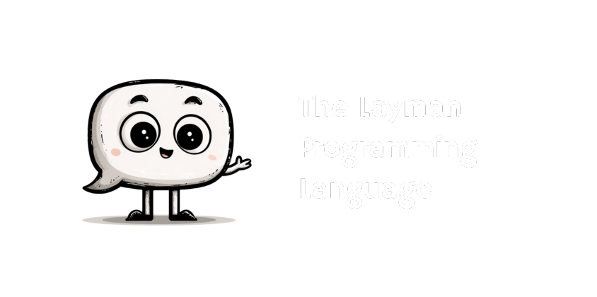

<p align="center">
  
</p>

# The Layman Language

> **Fully Deterministic English for Computation**

Layman is a programming language that bridges natural language and code. Programs use natural sentences with little special syntax—no brackets, semicolons, or operators. The same text always produces the same result, enabling consistent execution across different systems. Layman includes static typing, object-oriented programming, error handling, modules, and collections, and can be compiled to executables or interpreted directly.

[](https://github.com/layman-lang/layman/actions/workflows/ci.yml)
[]()

---

## Why Layman?

### The Problem
With LLMs, English is becoming a usable programming language. But there's a critical issue: **nondeterminism**. The same paragraph of text can be interpreted in multiple ways, leading to inconsistent results across different systems and implementations.

### The Solution
Layman provides **deterministic English** - programs that read like natural prose but parse to a precise, unambiguous Abstract Syntax Tree (AST). The same text always produces the same result.

### Key Features

| Feature | Description |
| :--- | :--- |
| **Pure English Syntax** | No special characters, reads like a paragraph |
| **Deterministic Parsing** | Same text, same AST, every time |
| **Type Safe** | Static typing with inference (`String`, `Number`, `Bool`, `Void`) |
| **Production Ready** | Compiled or interpreted, runs everywhere |
| **OOP Support** | Classes, objects, methods, inheritance |
| **Error Handling** | Try/Catch, Throw, custom error messages |
| **Modules** | Import system for code organization |
| **Collections** | Lists and Dictionaries with rich operations |
| **Cross-Platform** | Server, CLI, browser (via WebAssembly) |

---

## Command Line Interface

Layman provides a unified CLI for managing projects, compiling code, and running tests.

| Command | Description |
| :--- | :--- |
| `layman init [name]` | Initialize a new project |
| `layman run [file]` | Run a `.lay` file (or project entry point) |
| `layman compile [file]` | Compile a `.lay` file to an executable |
| `layman test [dir]` | Run all tests in a directory |
| `layman install [pkg]` | Install a package |
| `layman graph` | View dependency graph |

### CLI Usage Examples

#### Running Code
```bash
# Run the project in the current directory (looks for src/main.lay)
layman run

# Run a specific project directory
layman run my-project

# Run a specific file
layman run src/main.lay
```

#### Compiling Code
```bash
# Compile the project in the current directory
layman compile

# Compile a specific file
layman compile src/main.lay

# Compile with custom output name
layman compile src/main.lay --output my-app
```

#### Managing Projects
```bash
# Initialize a new project in the current directory
layman init

# Initialize a new project in a new directory
layman init my-new-app

# Initialize with a custom name
layman init --name custom-pkg
```

---

## Quick Start

### Editor Support

We provide a custom VS Code syntax highlighter. To use it, copy the `.vscode` folder to your project root or add the grammar to your local VS Code configuration.

### Installation

```bash
# Clone the repository
git clone <repository-url>
cd layman

# Build the compiler
cargo build --release

# Or use make
make build-release
```

### Your First Program

Create `hello.lay`:

```ruby
# hello world in layman

print 'Hello, World!'

the variable name of type String is 'Layman'
print 'Hello, ' + name
```

### Run It

```bash
# Compile and run in one step
cargo run -- hello.lay

# Or compile first, then run
cargo run -- compile hello.lay
./hello
```

---

## Verified Examples

The following examples are taken directly from our test suite, ensuring they are valid and working code.

### 1. Basic Variables (from `test-cases/functions/test_001.lay`)

```ruby
# Simple Variable Setup
# This program declares two integer variables and prints them.

the variable x of type Number is 5
the variable y of type Number is 10

# print both variables on separate lines
print the variable x
print the variable y
```

### 2. Control Flow & Enums (from `test-cases/control-flow/test_028.lay`)

```ruby
# Define an Enum Type and Verify Its Usage

# define enum values as constants
the variable color_red of type String is "red"
the variable color_green of type String is "green"
the variable color_blue of type String is "blue"

# declare a variable called my_color and assign it the value green
the variable my_color of type String is color_green

# verify that the declared variable is of type color (string representing color)
if my_color is color_green then
  print "the variable my_color is green"
else
  print "the variable my_color is something else"
end if
```

### 3. Functions & Logic (from `test-cases/functions/test_002.lay`)

```ruby
# Weather Forecast Logic

define function check_temperature that takes temperature as Number and activity as String and returns Bool
  if temperature is less than 60 then
    print "swimming is not recommended due to cold weather"
    return false
  else if temperature is greater than 74 then
    print "the activity is suitable for warm weather"
    return true
  else
    print "an error in the temperature reading"
    return false
  end if

define function current_temperature that takes dummy as Number and returns Number
  return 70

# get current weather conditions
the variable dummy_value of type Number is 0
the variable temperature of type Number is call function current_temperature with argument dummy_value

# determine if swimming is suitable
the variable activity of type String is "swimming"
the variable is_suitable of type Bool is call function check_temperature with argument temperature and argument activity
```

### 4. Lists & Iteration (from `test-cases/data-structures/test_162.lay`)

```ruby
# List creation, indexing, and iteration

test "list creation and indexing"
    the variable my_list is a list containing 10, 20, 30
    
    print my_list
    
    the variable first_item is item 1 of my_list
    expect first_item is 10
end test

test "list iteration"
    the variable numbers is a list containing 1, 2, 3
    the variable sum is 0
    
    for each num in numbers do
        the variable sum is sum + num
    end for
    
    expect sum is 6
end test
```

### 5. Object-Oriented Programming (from `test-cases/oop/test_oop_005.lay`)

```ruby
# Bank account class with deposit and withdrawal

define class BankAccount that has
  property balance of type Number
  property owner of type Text

  define function deposit that takes amount as Number and returns Void
    the variable current of type Number is get balance from self
    set balance in self to current plus amount

  define function withdraw that takes amount as Number and returns Void
    the variable current of type Number is get balance from self
    set balance in self to current minus amount

the variable account of type BankAccount is a new BankAccount with
  balance which is 1000
  owner which is 'John Doe'

call function deposit on account with amount 250
call function withdraw on account with amount 100
call function withdraw on account with amount 100
print get balance from account
```

### 6. Error Handling (from `test-cases/error-handling/test_try_catch_div_zero.lay`)

```ruby
# Try/Catch for division by zero

try
    print "Attempting division by zero"
    the variable x of type Number is 10 divided by 0
    print "This should not be printed"
catch error
    print "Caught error: " + error
end try
print "Program continued"
```


### 7. Modules (from `test-cases/imports/test_071.lay`)

```ruby
# Importing functions from another file

import "math_module"

the variable result is call function calculate_area with length 10 and width 5
print result
```

---

## Package Manager

Layman includes a built-in package manager (`lpm`) to manage dependencies, powered by Git.

### Commands

| Command | Description |
| :--- | :--- |
| `layman init` | Initialize a new project with `layman.toml` and a Hello World scaffold |
| `layman install <pkg>` | Install a package from a Git repository (e.g., `user/repo`) |
| `layman uninstall <pkg>` | Remove a package |
| `layman sync` | Install all dependencies listed in `layman.toml` |
| `layman graph` | Visualize the dependency tree |

### Usage

#### 1. Create a Project
```bash
mkdir my-project
cd my-project
layman init
```
This creates:
- `layman.toml`: Manifest file
- `src/main.lay`: Source code (Hello World)

#### 2. Install Dependencies
```bash
# Install from GitHub (shorthand)
layman install layman-lang/hello-layman

# Install from full URL
layman install https://github.com/layman-lang/hello-layman.git
```

#### 3. Use in Code
```layman
import "hello-layman/main"

call say_hello
```

#### 4. Manage
```bash
# View dependencies
layman graph

# Remove dependency
layman uninstall hello-layman
```


## Development

### Building

```bash
# Debug build
cargo build

# Release build
cargo build --release

# Or use make
make build
make build-release
```

### Running Tests

```bash
# Run all tests
cargo run -- test test-cases

# Or use make
make test

# Run a specific test
make test-file FILE=test-cases/test_001.lay
```

### Compiling Files

```bash
# Compile to executable
cargo run -- compile hello.lay
./hello

# Or use make
make compile FILE=hello.lay
```

### Development Workflow

```bash
# Clean build artifacts
make clean

# Clean test artifacts
make clean-tests

# Format code
make fmt

# Check linting
make lint

# Full verification (clean + build + test)
make verify
```

---

## Documentation

- **[EXAMPLES.md](EXAMPLES.md)** - Comprehensive list of examples generated from test cases
- **[GRAMMAR.md](GRAMMAR.md)** - Complete grammar specification with EBNF

### Key Concepts

#### Type System
- **Primitive Types**: `Number`, `String`, `Bool`, `Void`
- **Type Inference**: Types inferred from literals
- **Custom Types**: Capitalized class names (`Person`, `Calculator`)
- **Type Annotations**: `of type <Type>`

#### Object Creation
- Syntax: `is a new <Type> with <properties>`
- Context-aware: `is a` only creates objects when followed by `new`
- Multi-line property assignments with indentation

#### File Extension
- Layman files use `.lay` extension
- Compiled artifacts use `.layc` extension

#### Import System

Layman supports flexible import syntaxes:

1. **Package Import** (Recommended)
   ```layman
   import "package/module"
   ```
   Resolves to `modules/package/src/module.lay`.

2. **Local File Import**
   ```layman
   import file "./utils.lay"
   ```
   Imports a file relative to the current file.

3. **Module Import**
   ```layman
   import math_module
   ```
   Imports `math_module.lay` from the same directory or standard library.

4. **Aliased Import**
   ```layman
   import "long/package/name" as pkg
   ```

---

## Project Structure

```
layman/
├── src/                    # Rust source code
│   ├── ast/               # Abstract Syntax Tree
│   ├── codegen/           # Code generation
│   ├── evaluator/         # Interpreter/executor
│   ├── lexer/             # Tokenizer
│   ├── lpm/               # Package manager
│   ├── parser/            # AST builder
│   ├── resolver/          # Import resolver
│   ├── stdlib/            # Built-in functions
│   ├── typechecker/       # Static type checker
│   ├── types/             # Type system
│   ├── utils/             # Utility functions
│   ├── main.rs            # CLI entry point
│   └── verify.rs          # Verification logic
├── std/                    # Standard Library (Layman code)
├── test-cases/             # 440+ test cases
├── tests/                  # Integration tests
├── Cargo.toml              # Rust dependencies
├── EXAMPLES.md             # Generated examples
├── GRAMMAR.md              # Grammar documentation with EBNF
├── Makefile                # Build and test commands
├── README.md               # This file
```

---

## Testing

The test suite includes 280+ test cases covering:
- Variable declarations and assignments
- Type checking and inference
- Functions and function calls
- Conditionals and loops
- Object-oriented programming
- Standard library functions
- Edge cases and error handling

All tests verify:
1. **Lexing** - Tokenization succeeds
2. **Parsing** - AST construction succeeds
3. **Type Checking** - Static analysis passes
4. **Execution** - Programs run successfully

Run tests:
```bash
make test
```

### Development Setup

1. Clone the repository
2. Build with `cargo build` or `make build`
3. Run tests with `make test`
4. Read `SPEC.md` and `GRAMMAR.md` for language details

---

## 📄 License

MIT License

---

## Acknowledgments

Layman is inspired by:
- Python's readability
- Rust's type safety and performance
- TypeScript's modern features
- Haskell's mathematical elegance

---

## Contact & Resources

- **Grammar**: See [GRAMMAR.md](GRAMMAR.md)

---

**Happy Programming in Pure English!**
